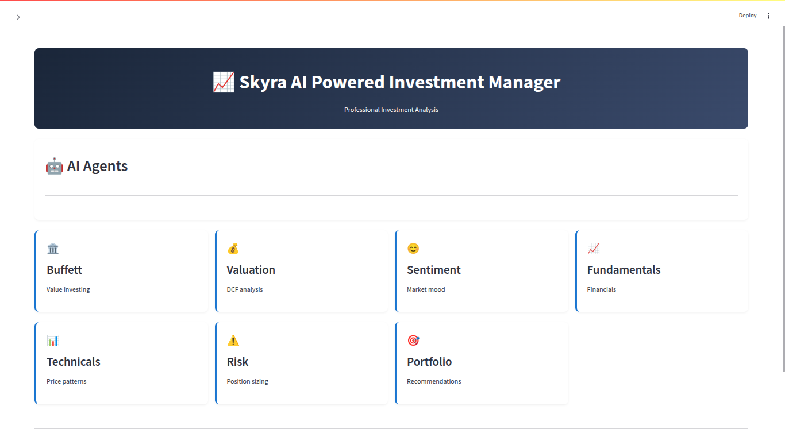
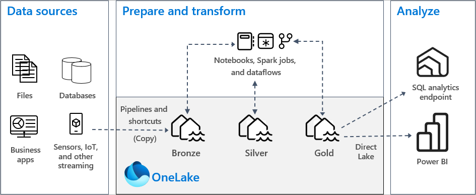

# 🌌 Skyra: A Smart AI-Powered Investment Manager

<p align="center">
  
</p>

**Skyra** is a multi-agent investment manager powered by AI that helps users make smarter, faster investment decisions using real-time stock data and expert-level analysis.

Skyra analyzes stocks from multiple perspectives—valuation, sentiment, fundamentals, technicals, and risk—to deliver actionable insights like whether to **Buy**, **Hold**, or **Sell** a stock. It’s designed to simulate the thinking of a world-class financial team—on autopilot.

---

## 🚀 Features

- 🔄 **Real-Time Market Data Ingestion**
  - Integrated with Twelve Data, Alpha Vantage, and Financial Modeling Prep
  - Supports multiple tickers for up-to-the-minute analysis

- 🧠 **Multi-Agent Architecture Powered by GPT-4o**
  - **Warren Buffett Agent**: Finds wonderful companies at fair prices.
  - **Valuation Agent**: Calculates intrinsic value and issues signals.
  - **Sentiment Agent**: Tracks market mood from news and social platforms.
  - **Fundamentals Agent**: Analyzes financial health of companies.
  - **Technicals Agent**: Looks at moving averages, RSI, and more.
  - **Risk Manager**: Sets position limits and calculates risk metrics.
  - **Portfolio Manager**: Synthesizes all insights and gives final action.

- 🏛️ **Built on Microsoft Fabric with Medallion Architecture**
  - Uses Bronze, Silver, and Gold layers to clean, enrich, and transform stock data.
  - Processes and stores data in a lakehouse model via Fabric Data Pipelines.

<p align="center">
  
</p>

- 📬 **Email Notifications and Reflex Triggers**
  - Get instant alerts when a ticker spikes or dips.
  - Automated responses and summaries generated using Semantic Kernel.

---

## 🧩 Tech Stack

- **Microsoft Fabric**
  - EventStream
  - Lakehouse
  - Data Pipelines
- **Azure AI / OpenAI GPT-4o**
  - Used for intelligent agent completions.
- **Semantic Kernel**
  - Agent coordination and orchestration.
- **Twelve Data, Alpha Vantage APIs**
  - Real-time stock data feeds.
- **AI Foundry**
  - Agents management and deployment.
- **Python & Pydantic**
  - Data modeling and logic control.
- **Reflex + Activations**
  - Trigger system for automatic actions and email alerts.

---

## 📊 Example Use Case

A user selects stock tickers (e.g., AAPL, MSFT)
1. Ingests real-time data from APIs.
2. Runs each stock through a network of agents.
3. Each agent analyzes from their intelligent actions.
4. Portfolio Manager compiles insights into final action.
5. User receives an email summary:  
   _“Apple Inc. is currently undervalued with strong fundamentals. Market sentiment is bullish. Recommended action: **BUY**.”_

---

## 📽️ Demo Video

➡️ Watch the full system in action: [Demo Link](https://vimeo.com/1073716649/1dbbd64d25?share=copy)

---

## 📁 Folder Structure

```bash
Skyra/
├── agents/
│   ├── agents.py
│   └── sdk_intergration.py
├── app/
│   ├── reflex_triggers/
│   └── notifications/
├── data/
│   ├── raw/          # Bronze Layer
│   ├── cleaned/      # Silver Layer
│   └── enriched/     # Gold Layer
├── images/
│   ├── app.png
│   └── medallion.png
├── notebooks/
│   ├── bronze_ingestion.ipynb
│   ├── data_streaming.ipynb
│   ├── gold_enriched.ipynb
│   ├── pipeline_orchestration.ipynb
│   └── silver_ingestion.ipynb
├── LICENSE
├── README.md
├── SkyraPresentation.pdf
└── SubmissionVideo.mp4
